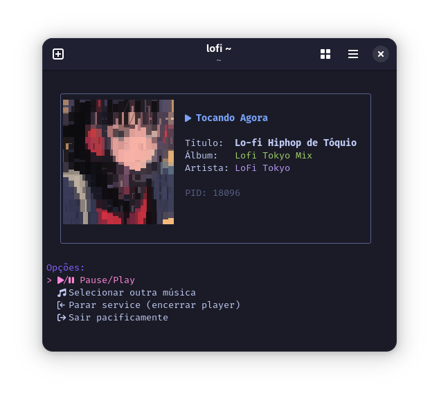

# lofi-room.sh

**seu lofi no terminal**

  um mini estúdio para criar e curtir sua própria coleção de lofi, diretamente do seu terminal.

  baixe do youtube, organize suas faixas e mergulhe na vibe.

## ✨ screenshots

  
  

 

## 🚀 funcionalidades

| Script | Descrição |
| --- | --- |
| `down.sh` | Baixe áudios de vídeos do YouTube em formato MP3. |
| `edit-mp3.sh` | Edite os metadados (título, artista, álbum) e adicione uma capa. |
| `lofi.sh` | Player com UI no terminal, exibindo capa e informações da faixa. |

## 💿 como usar

-  Clone este repositório.
-  Instale as dependências listadas abaixo.
-  Coloque seus arquivos de áudio em `~/Músicas`.
-  Execute `./lofi.sh` para iniciar a vibe.

  
🔧 dependências

  
  * `mpv` (o player de áudio)
  * `yt-dlp` (para baixar do YouTube)
  * `ffmpeg` (para edição de metadados e extração de capa)
  * `gum` (para a interface no terminal)
  * `chafa` (para exibir a arte do álbum no terminal)
  * `jq` (para processar dados JSON dos metadados)
  * `dbus-send` (para controlar o player)

