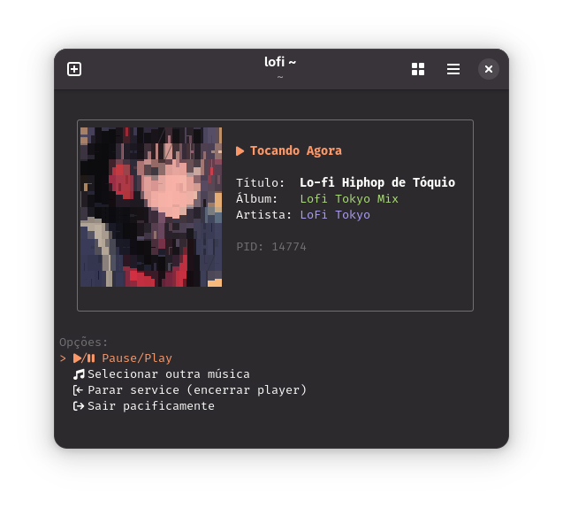

# lofi-room.sh

**seu lofi no terminal**

  um mini estúdio para baixar e curtir sua própria coleção de lofi, diretamente do seu terminal.

  baixe do youtube, organize suas faixas e mergulhe na vibe.

## ✨ screenshots

  
  

 

## 🚀 funcionalidades

| Script | Descrição |
| --- | --- |
| `down.sh` | Baixe áudios de vídeos do YouTube em formato MP3. |
| `edit-mp3.sh` | Edite os metadados (título, artista, álbum) e adicione uma capa. |
| `lofi.sh` | Player com UI no terminal, exibindo capa e informações da faixa. |

## 💿 como usar

-  Clone este repositório.
-  Instale as dependências listadas abaixo.
-  Coloque seus arquivos de áudio em `~/Músicas`.
-  Execute `./lofi.sh` para iniciar a vibe.

## 🆚 comparação com outros players

| Feature | YouTube Music | Spotify | Elisa | Amberol | lofi-room.sh |
|---------|---------------|---------|-------|---------|--------------|
| **Offline-first** | ❌ | ❌ | ✅ | ✅ | ✅ |
| **Sem anúncios** | ❌ | ❌ | ✅ | ✅ | ✅ |
| **Uso de RAM** | ~400-600MB | ~300-500MB | ~150-200MB | ~100-150MB | **~50MB** |
| **Terminal-based** | ❌ | ❌ | ❌ | ❌ | ✅ |
| **Album art** | ✅ | ✅ | ✅ | ✅ | ✅ |
| **Service mode** | ❌ | ❌ | ❌ | ✅ | ✅ |
| **Sem internet** | ❌ | ❌ | ✅ | ✅ | ✅ |
| **Controle total** | ❌ | ❌ | ✅ | ✅ | ✅ |
| **Download integrado** | ❌ | ❌ | ❌ | ❌ | ✅ |
| **Editor de metadados** | ❌ | ❌ | ❌ | ❌ | ✅ |
| **Funciona via SSH** | ❌ | ❌ | ❌ | ❌ | ✅ |
| **Multiplataforma** | ✅ | ✅ | ✅ | ✅ | ✅ |

### 🎯 quando usar lofi-room.sh?

- ✅ Você quer uma biblioteca **100% offline** sem depender de streaming
- ✅ Seu PC tem recursos limitados e apps GUI são **muito pesados**
- ✅ Você vive no **terminal** e não quer alternar pra GUI
- ✅ Quer **controle total** sobre seus arquivos e metadados
- ✅ Precisa de um player que funciona **via SSH** em servidores remotos
- ✅ Curte o **aesthetic terminal** com capas em ASCII art

  
🔧 dependências

  
  * `mpv` (o player de áudio)
  * `yt-dlp` (para baixar do YouTube)
  * `ffmpeg` (para edição de metadados e extração de capa)
  * `gum` (para a interface no terminal)
  * `chafa` (para exibir a arte do álbum no terminal)
  * `jq` (para processar dados JSON dos metadados)
  * `dbus-send` (para controlar o player)

